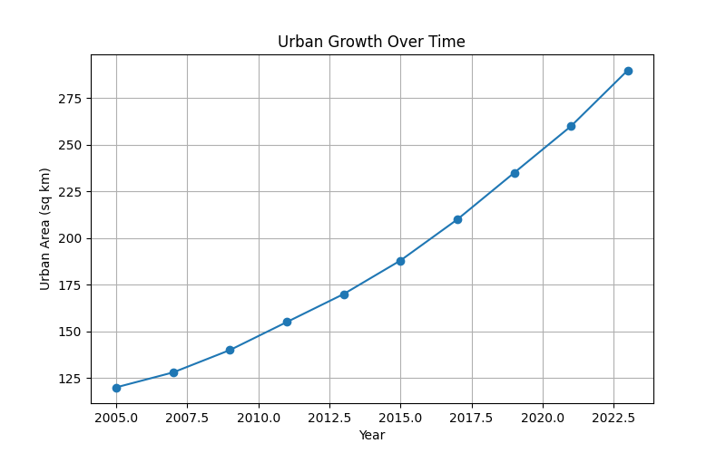
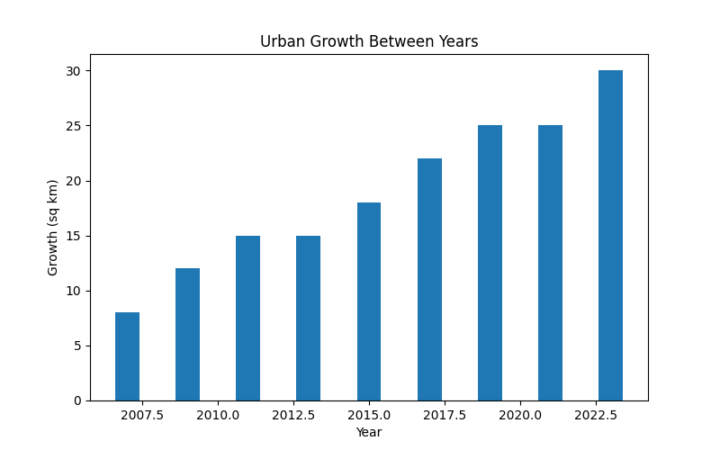

# Urban Growth Analysis

## Overview :-

This project analyzes urban growth trends over time using Python and data visualization techniques. The objective is to understand how urban areas expand and identify whether growth is occurring at a constant or accelerating rate.

## Dataset :-

The dataset contains:

* Year
* Urban Area (sq km)

Data spans from 2005 to 2023.

## Tools Used :-

* Python
* Pandas
* Matplotlib

## Analysis Performed :-

* Dataset exploration and statistical summary
* Urban growth trend visualization
* Growth calculation between observation periods
* Average growth rate analysis
* Bar chart visualization of urban expansion

## Key Findings :-

* Urban area increased from 120 sq km in 2005 to 290 sq km in 2023.
* Average growth was approximately 19 sq km per observation period.
* Growth rates increased over time, indicating accelerating urban expansion.

## Visualizations :-

### Urban Growth Trend

 

### Urban Growth Between Years

 

## Conclusion

The analysis shows a consistent increase in urban area over the study period. Growth rates generally increased with time, suggesting accelerated urban development. Such analyses can support urban planning, infrastructure development, and environmental assessment studies.
